# Some ideas for exploring missing data

Nicholas Tierney

Infectious Disease Ecology and Modelling group

Telethon Kids Institute, Perth, WA, Australia

## Introduction

If you’ve done data analysis, then chances are you’ve encountered
missing data. I’ve encountered my fair share of missing data and I felt
so frustrated by how hard it was to handle and wrangle with them that I
have written two R packages (visdat, naniar), and several papers on the
topic.

The goal of this article is to share some condensed ideas on exploring
missing data, using the software I’ve written, `naniar`, and `visdat`.
To that end, we will focus on four questions, how do we:

1.  Start looking at missing data?
2.  Explore missingness in variables?
3.  Explore missingness relationships?
4.  Explore imputed values

# Start looking at missing data?

``` r
options(tidyverse.quiet = TRUE)
library(tidyverse)
library(visdat)
library(naniar)
```

We can use the `visdat` package (Tierney 2017) to get an overview of the
missingness of an entire data set. It was heavily inspired by
[`csv-fingerprint`](https://setosa.io/blog/2014/08/03/csv-fingerprints/),
and functions like `missmap`, from `Amelia` (Honaker, King, and
Blackwell 2011).

We can use `visdat`’s `vis_miss()` function to visualise the missingness
of a whole dataframe. It displays the data as missing, or not missing,
and provides the amount of missings in each columns:

``` r
vis_miss(airquality)
```

<figure>
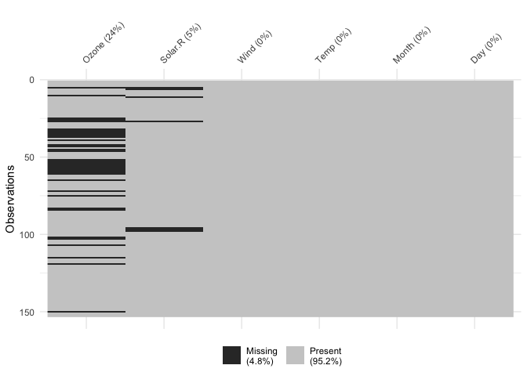
<figcaption aria-hidden="true">An overview of missing data in the
airquality dataset. The x axis shows the variables of the data, along
with the amount of missingness in that variable, and the y axis shows
the rows. Each cell represents the missingness of a datum. The overall
missingness is given in a percentage below in the legend. We learn that
there is nearly 5% missing data overall, the missing data occurs in
Ozone and Solar.R, and mostly in Ozone.</figcaption>
</figure>

We learn that there is nearly 5% missing data overall, the missing data
occurs in Ozone and Solar.R, and mostly in Ozone. The other variables do
not have any missing data.

### Facetting in visdat

You can also split up the `vis_miss` plots into several facetted plots
via the `facet` argument. For example, we can facet by the `Month`
variable:

``` r
vis_miss(airquality, facet = Month) 
```

<figure>
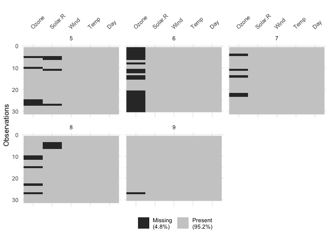
<figcaption aria-hidden="true">An further overview of missing data in
the airquality dataset. Similar to the previous graphic, we now present
a facetted series of sub plots, one for each Month. We learn from this
that most of the Ozone missingness happens in Month 6, and there aren’t
missing values for months 6, 7, and 9.</figcaption>
</figure>

We learn from this that most of the Ozone missingness happens in Month
6, and there aren’t missing values for months 6, 7, and 9.

There are other functions in the visdat package that focus on other
types of data, for example, `vis_value()`, `vis_binary()`, and
`vis_compare()`. To read more about the functions available in `visdat`
see the vignette [“Using
visdat”](https://CRAN.R-project.org/package=visdat/vignettes/using_visdat.html).

## Explore missingness in variables

Another approach to visualising the missingness in a dataset is to use
the `gg_miss_var` plot:

``` r
gg_miss_var(airquality)
```

<figure>
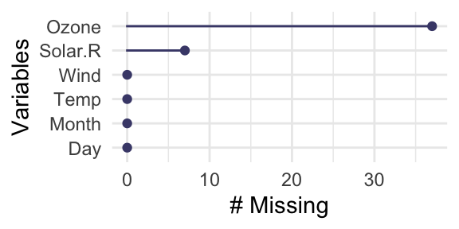
<figcaption aria-hidden="true">Number of missing values for each
variable. The x axis shows the number of missings, and the y axis shows
each variable. We learn Ozone and Solar.R have the most missing data,
and Ozone has the most missing data.</figcaption>
</figure>

This displays the number of missing values in each variable. We learn
that there are pretty much only missing values for Ozone and Solar, with
more for Ozone. Just like with `vis_miss()`, we can add in facets in
these plots, via the `facet` argument:

``` r
gg_miss_var(airquality, facet = Month)
```

<figure>
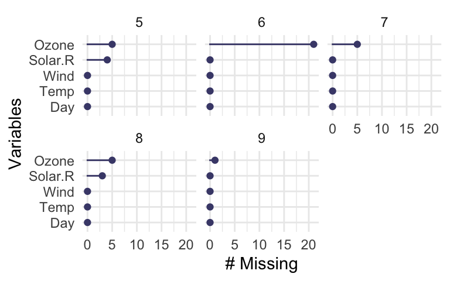
<figcaption aria-hidden="true">Similar to the above plot but one subplot
for each Month. We learn that most of the missing values occur in month
6 for Ozone, and that months 6, 7, and 9 don’t have and Solar.R missing
values.</figcaption>
</figure>

Where we learn that month 9 doesn’t have much missing data, and a lot of
the missing data seems to occur in month 6.

There are more visualisations available in `naniar` (each starting with
`gg_miss_`) - you can see these in the [“Gallery of Missing Data
Visualisations”
vignette](https://cran.r-project.org/package=naniar/vignettes/naniar-visualisation.html).
The plots created with the `gg_miss` family all have a basic theme, but
you can customise them, and add arguments like so:

``` r
# probably don't need to output the images for these two, including the code is sufficient
gg_miss_var(airquality) + theme_bw() 
```

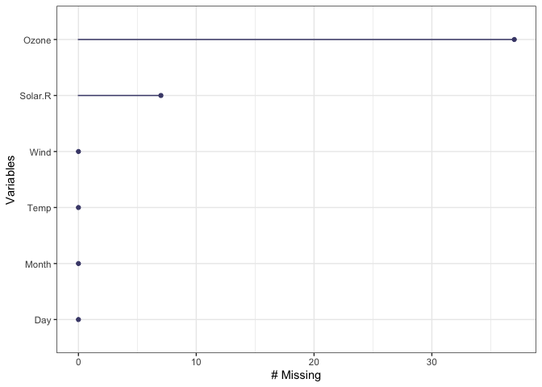

``` r
gg_miss_var(airquality) + labs(y = "Look at all the missing ones")
```

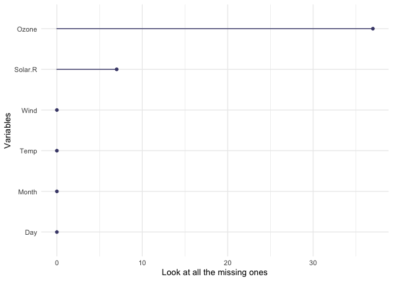

It is also worth noting that for every visualisation of missing data in
`naniar`, there is an accompanying function to extract the data used in
the plot. This is important as the plot should not return a dataframe -
but we want to make the data available for use by the user so it isn’t
locked into a plot.

You can find these summary plots below, with `miss_var_summary()`
providing the dataframe that `gg_miss_var()` is based on.

``` r
miss_var_summary(airquality)
```

    # A tibble: 6 × 3
      variable n_miss pct_miss
      <chr>     <int>    <dbl>
    1 Ozone        37    24.2 
    2 Solar.R       7     4.58
    3 Wind          0     0   
    4 Temp          0     0   
    5 Month         0     0   
    6 Day           0     0   

Which also works with `group_by()`:

``` r
airquality %>% 
  group_by(Month) %>% 
  miss_var_summary()
```

    # A tibble: 25 × 4
    # Groups:   Month [5]
       Month variable n_miss pct_miss
       <int> <chr>     <int>    <dbl>
     1     5 Ozone         5     16.1
     2     5 Solar.R       4     12.9
     3     5 Wind          0      0  
     4     5 Temp          0      0  
     5     5 Day           0      0  
     6     6 Ozone        21     70  
     7     6 Solar.R       0      0  
     8     6 Wind          0      0  
     9     6 Temp          0      0  
    10     6 Day           0      0  
    # ℹ 15 more rows

Similarly, there is a `data_vis_miss()` function in the `visdat`
package, which returns the data in the format that this visualisation
requires.

``` r
data_vis_miss(airquality)
```

    # A tibble: 918 × 4
        rows variable valueType value
       <int> <chr>    <chr>     <chr>
     1     1 Day      FALSE     FALSE
     2     1 Month    FALSE     FALSE
     3     1 Ozone    FALSE     FALSE
     4     1 Solar.R  FALSE     FALSE
     5     1 Temp     FALSE     FALSE
     6     1 Wind     FALSE     FALSE
     7     2 Day      FALSE     FALSE
     8     2 Month    FALSE     FALSE
     9     2 Ozone    FALSE     FALSE
    10     2 Solar.R  FALSE     FALSE
    # ℹ 908 more rows

The aim of these is to provide the data required to make these
visualisations, so if people want to create their own more customised
versions of `vis_miss()` or `gg_miss_var()` then they can do that.

## Exploring missingness relationships

We can identify key variables that are missing using `vis_miss()` and
`gg_miss_var()`, but for further exploration, we need to explore the
relationship amongst the variables in this data:

- Ozone,
- Solar.R
- Wind
- Temp
- Month
- Day

Typically, when exploring this data, we might want to explore the
variables Solar.R and Ozone, and so plot a scatter plot of solar
radiation and ozone, like so:

``` r
library(ggplot2)
ggplot(airquality, 
       aes(x = Solar.R, 
           y = Ozone)) + 
  geom_point()
```

    Warning: Removed 42 rows containing missing values (`geom_point()`).

<figure>
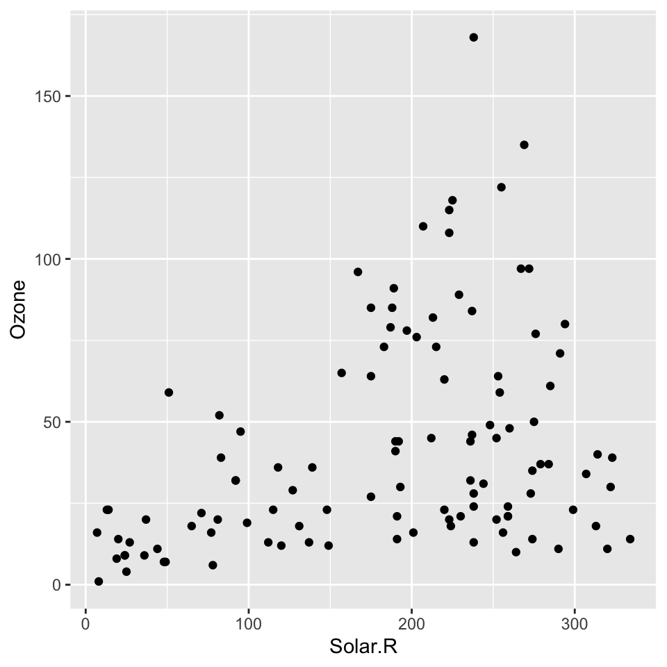
<figcaption aria-hidden="true">Plot of Solar.R against Ozone. Solar.R is
on the X axis and Ozone is on the Y axis. We learn that there is a
slight positive correlation of Ozone with Solar.R</figcaption>
</figure>

The problem with this is ggplot does not handle missings be default, and
removes the missing values. This makes them hard to explore. It also
presents the strange question of “how do you visualise something that is
not there?”. One approach to visualising missing data comes from
[`ggobi`](https://en.wikipedia.org/wiki/GGobi) and
[`manet`](http://www.rosuda.org/MANET/), where we impute “NA” values
with values 10% lower than the minimum value in that variable, which
puts these values in a margin area on the graphic.

This imputation is wrapped up in the `geom_miss_point()` ggplot2 geom.
Here, we illustrate by exploring the relationship between Ozone and
Solar radiation from the airquality dataset.

``` r
ggplot(airquality, 
       aes(x = Solar.R, 
           y = Ozone)) + 
  geom_miss_point() + 
  scale_colour_brewer(palette = "Dark2")
```

<figure>
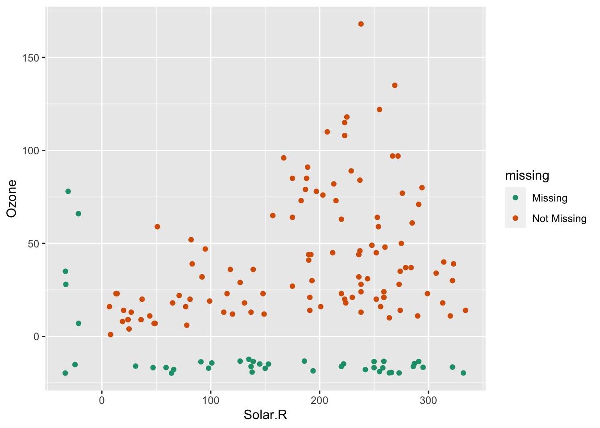
<figcaption aria-hidden="true">Improved plot of Ozone against Solar.R,
we can now see the missing values are imputed 10% below the minimum
value. The green dots on the x axis represent the Solar.R values that
have missing Ozone. The green dots on the Y axis represent Ozone values
that have missing Solar.R. The two dots in the bottom left corner are
missing for both Ozone and Solar.R</figcaption>
</figure>

Being a proper ggplot geom, it supports all of the standard features of
ggplot2, such as **facets** and **themes**,

``` r
ggplot(airquality, 
       aes(x = Solar.R, 
           y = Ozone)) + 
  geom_miss_point() + 
  facet_wrap(~Month) + 
  theme_dark()
```

<figure>
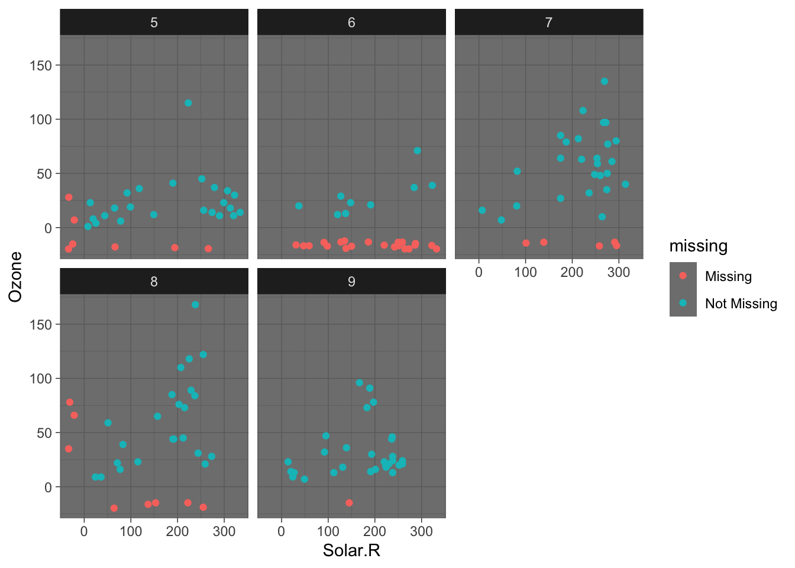
<figcaption aria-hidden="true">A faceted version of the improved Ozone
against Solar.R plot where each month is split out into its own
subplot.</figcaption>
</figure>

## Numerical summaries of missing values

`naniar` provide numerical summaries for missing data. Two convenient
counters of complete values and missings are `n_miss()` and
`n_complete()`. These work on both dataframes and vectors, similar to
`dplyr::n_distinct()`

``` r
dplyr::n_distinct(airquality)
```

    [1] 153

``` r
dplyr::n_distinct(airquality$Ozone)
```

    [1] 68

``` r
n_miss(airquality)
```

    [1] 44

``` r
n_miss(airquality$Ozone)
```

    [1] 37

``` r
n_complete(airquality)
```

    [1] 874

``` r
n_complete(airquality$Ozone)
```

    [1] 116

The syntax for the other numerical sumamries in `naniar` are `miss_`,
and then `case`, or `var` to refer to cases or variables. There are then
`summary`, `table`, `run`, `span`, and `cumsum` options to explore
missing data.

`prop_miss_case` and `pct_miss_case` return numeric value describing the
proportion or percent of missing values in the dataframe.

``` r
prop_miss_case(airquality)
```

    [1] 0.2745098

``` r
pct_miss_case(airquality)
```

    [1] 27.45098

`miss_case_summary()` returns a numeric value that describes the number
of missings in a given case (aka row), the percent of missings in that
row.

``` r
miss_case_summary(airquality)
```

    # A tibble: 153 × 3
        case n_miss pct_miss
       <int>  <int>    <dbl>
     1     5      2     33.3
     2    27      2     33.3
     3     6      1     16.7
     4    10      1     16.7
     5    11      1     16.7
     6    25      1     16.7
     7    26      1     16.7
     8    32      1     16.7
     9    33      1     16.7
    10    34      1     16.7
    # ℹ 143 more rows

`miss_case_table()` tabulates the number of missing values in a case /
row. Below, this shows the number of missings in a case:

``` r
miss_case_table(airquality)
```

    # A tibble: 3 × 3
      n_miss_in_case n_cases pct_cases
               <int>   <int>     <dbl>
    1              0     111     72.5 
    2              1      40     26.1 
    3              2       2      1.31

We can interpret this output as follows:

- There are 111 cases with 0 missings, which comprises about 72% of the
  data.
- There are then 40 cases with 1 missing, these make up 26% of the data.
- There are then 2 cases with 2 missing - these make up 1% of the data.

Similar to `pct_miss_case()`, `prop_miss_case()`, `pct_miss_var()` and
`prop_miss_var()` returns the percent and proportion of variables that
contain a missing value.

``` r
prop_miss_var(airquality)
```

    [1] 0.3333333

``` r
pct_miss_var(airquality)
```

    [1] 33.33333

`miss_var_summary()` then returns the number of missing values in a
variable, and the percent missing in that variable.

``` r
miss_var_summary(airquality)
```

    # A tibble: 6 × 3
      variable n_miss pct_miss
      <chr>     <int>    <dbl>
    1 Ozone        37    24.2 
    2 Solar.R       7     4.58
    3 Wind          0     0   
    4 Temp          0     0   
    5 Month         0     0   
    6 Day           0     0   

Finally, `miss_var_table()`. This describes the number of missings in a
variable.

- There are 4 variables with 0 missings, comprising 66.67% of variables
  in the dataset.
- There is 1 variable with 7 missings
- There is 1 variable with 37 missings

``` r
miss_var_table(airquality)
```

    # A tibble: 3 × 3
      n_miss_in_var n_vars pct_vars
              <int>  <int>    <dbl>
    1             0      4     66.7
    2             7      1     16.7
    3            37      1     16.7

There are also summary functions for exploring missings that occur over
a particular span or period of the dataset, or the number of missings in
a single run:

- `miss_var_run()`, and
- `miss_var_span()`

`miss_var_run()` can be particularly useful in time series data, as it
allows you to provide summaries for the number of missings or complete
values in a single run. The function `miss_var_run()` provides a data
frame of the run length of missings and complete values. To explore this
function we will use the built-in dataset, `pedestrian`, which contains
hourly counts of pedestrians from four locations around Melbourne,
Australia, from 2016.

To use `miss_var_run()`, you specify the variable that you want to
explore the runs of missingness for, in this case, `hourly_counts`:

``` r
miss_var_run(pedestrian,
             hourly_counts)
```

    # A tibble: 35 × 2
       run_length is_na   
            <int> <chr>   
     1       6628 complete
     2          1 missing 
     3       5250 complete
     4        624 missing 
     5       3652 complete
     6          1 missing 
     7       1290 complete
     8        744 missing 
     9       7420 complete
    10          1 missing 
    # ℹ 25 more rows

`miss_var_span()` is used to determine the number of missings over a
specified repeating span of rows in variable of a dataframe. Similar to
`miss_var_run()`, you specify the variable that you wish to explore, you
then also specify the size of the span with the `span_every` argument.

``` r
miss_var_span(pedestrian,
              hourly_counts,
              span_every = 100)
```

    # A tibble: 377 × 6
       span_counter n_miss n_complete prop_miss prop_complete n_in_span
              <int>  <int>      <int>     <dbl>         <dbl>     <int>
     1            1      0        100         0             1       100
     2            2      0        100         0             1       100
     3            3      0        100         0             1       100
     4            4      0        100         0             1       100
     5            5      0        100         0             1       100
     6            6      0        100         0             1       100
     7            7      0        100         0             1       100
     8            8      0        100         0             1       100
     9            9      0        100         0             1       100
    10           10      0        100         0             1       100
    # ℹ 367 more rows

# Explore imputed values

Using the
[`simputation`](https://cran.r-project.org/package=simputation) package,
we impute values for Ozone, then visualise the data:

``` r
library(simputation)
```


    Attaching package: 'simputation'

    The following object is masked from 'package:naniar':

        impute_median

``` r
library(dplyr)

airquality %>%
  impute_lm(Ozone ~ Temp + Wind) %>%
  ggplot(aes(x = Temp,
             y = Ozone)) + 
  geom_point()
```

<figure>
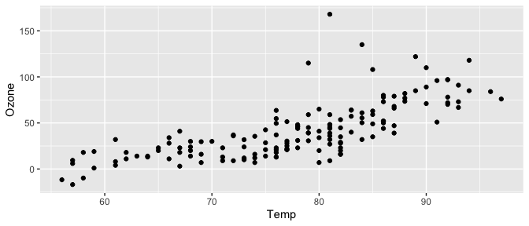
<figcaption aria-hidden="true">Imputed values are not visible. A plot of
Ozone by Temperature. The Imputed Ozone values are not visible because
we have no way to identify them in the data.</figcaption>
</figure>

Note that we no longer get any errors regarding missing observations -
because they are all imputed! But this comes at a cost: we also no
longer have information about where the imputations are - they are now
sort of invisible.

We can track a copy of the missing data locations by using the function
`nabular()`, which binds another dataset to the current one which notes
the locations of the missing data. This is a really important idea with
`naniar`, but to keep it brief, the data looks like this:

``` r
nabular(airquality)
```

    # A tibble: 153 × 12
       Ozone Solar.R  Wind  Temp Month   Day Ozone_NA Solar.R_NA Wind_NA Temp_NA
       <int>   <int> <dbl> <int> <int> <int> <fct>    <fct>      <fct>   <fct>  
     1    41     190   7.4    67     5     1 !NA      !NA        !NA     !NA    
     2    36     118   8      72     5     2 !NA      !NA        !NA     !NA    
     3    12     149  12.6    74     5     3 !NA      !NA        !NA     !NA    
     4    18     313  11.5    62     5     4 !NA      !NA        !NA     !NA    
     5    NA      NA  14.3    56     5     5 NA       NA         !NA     !NA    
     6    28      NA  14.9    66     5     6 !NA      NA         !NA     !NA    
     7    23     299   8.6    65     5     7 !NA      !NA        !NA     !NA    
     8    19      99  13.8    59     5     8 !NA      !NA        !NA     !NA    
     9     8      19  20.1    61     5     9 !NA      !NA        !NA     !NA    
    10    NA     194   8.6    69     5    10 NA       !NA        !NA     !NA    
    # ℹ 143 more rows
    # ℹ 2 more variables: Month_NA <fct>, Day_NA <fct>

The key takeaway here is that there is now a copy of the data bound to
it, with each column ending in `_NA`, and the values either being “NA”
for missing, or “!NA” for not missing. For more details on the theory
underlying this, and the benefits of this, we recommend reading our
paper, “Expanding Tidy Data Principles to Facilitate Missing Data
Exploration, Visualization and Assessment of Imputations” (Tierney and
Cook 2023).

Using the shadow matrix to keep track of where the missings are, you can
actually keep track of the imputations, colouring by what was previously
missing in Ozone. For example, let’s create the nabular data, then
impute the data and plot it.

``` r
aq_lm_imputed <- airquality %>%
  nabular() %>% 
  as.data.frame() %>% 
  impute_lm(Ozone ~ Temp + Wind)

head(aq_lm_imputed)
```

          Ozone Solar.R Wind Temp Month Day Ozone_NA Solar.R_NA Wind_NA Temp_NA
    1  41.00000     190  7.4   67     5   1      !NA        !NA     !NA     !NA
    2  36.00000     118  8.0   72     5   2      !NA        !NA     !NA     !NA
    3  12.00000     149 12.6   74     5   3      !NA        !NA     !NA     !NA
    4  18.00000     313 11.5   62     5   4      !NA        !NA     !NA     !NA
    5 -11.67673      NA 14.3   56     5   5       NA         NA     !NA     !NA
    6  28.00000      NA 14.9   66     5   6      !NA         NA     !NA     !NA
      Month_NA Day_NA
    1      !NA    !NA
    2      !NA    !NA
    3      !NA    !NA
    4      !NA    !NA
    5      !NA    !NA
    6      !NA    !NA

``` r
  ggplot(aq_lm_imputed,
         aes(x = Temp,
             y = Ozone,
             colour = Ozone_NA)) + 
  geom_point() + 
  scale_colour_brewer(palette = "Dark2")
```

<figure>
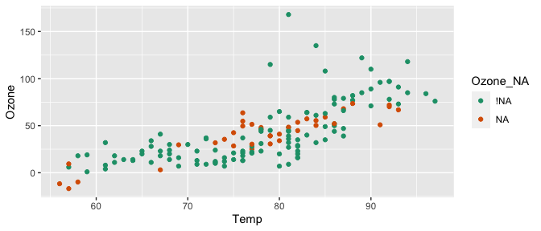
<figcaption aria-hidden="true">Regression imputed values of Ozone in a
scatterplot of Ozone vs Temperature. Temperature is on the X axis and
Ozone is on the Y axis, and the points are coloured by whether they are
imputed - ‘NA’ indicates a previously missing value that has been
imputed. We learn that the regression imputation imputes the values
approximately amongst the rest of the data, at the surface level, this
appears to be a good imputation.</figcaption>
</figure>

Let’s contrast this to how poor imputing just the mean value is, using
`impute_mean_all()`:

``` r
aq_mean_imputed <- airquality %>%
  nabular() %>% 
  as.data.frame() %>% 
  impute_mean_all()

head(aq_mean_imputed)
```

         Ozone  Solar.R Wind Temp Month Day Ozone_NA Solar.R_NA Wind_NA Temp_NA
    1 41.00000 190.0000  7.4   67     5   1      !NA        !NA     !NA     !NA
    2 36.00000 118.0000  8.0   72     5   2      !NA        !NA     !NA     !NA
    3 12.00000 149.0000 12.6   74     5   3      !NA        !NA     !NA     !NA
    4 18.00000 313.0000 11.5   62     5   4      !NA        !NA     !NA     !NA
    5 42.12931 185.9315 14.3   56     5   5       NA         NA     !NA     !NA
    6 28.00000 185.9315 14.9   66     5   6      !NA         NA     !NA     !NA
      Month_NA Day_NA
    1      !NA    !NA
    2      !NA    !NA
    3      !NA    !NA
    4      !NA    !NA
    5      !NA    !NA
    6      !NA    !NA

``` r
ggplot(aq_mean_imputed,
       aes(x = Temp,
             y = Ozone,
             colour = Ozone_NA)) + 
  geom_point() + 
  scale_colour_brewer(palette = "Dark2")
```

<figure>
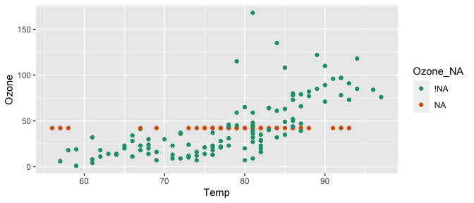
<figcaption aria-hidden="true">The same plot as above, but using mean
imputation. We learn that mean imputation places the imputed values all
at a single point, which does not represent the variation we see in the
data.</figcaption>
</figure>

# Conclusion

In this software corner we have demonstrated the use of the `visdat` and
`naniar` R packages for exploring and understanding missing data.

# References

<div id="refs" class="references csl-bib-body hanging-indent"
entry-spacing="0">

<div id="ref-amelia" class="csl-entry">

Honaker, James, Gary King, and Matthew Blackwell. 2011. “: A Program for
Missing Data.” *Journal of Statistical Software* 45 (1): 1–47.
<https://doi.org/10.18637/jss.v045.i07>.

</div>

<div id="ref-visdat" class="csl-entry">

Tierney, Nicholas. 2017. “: Visualising Whole Data Frames.” *The Journal
of Open Source Software* 2 (16): 355.
<https://doi.org/10.21105/joss.00355>.

</div>

<div id="ref-Tierney2023" class="csl-entry">

Tierney, Nicholas, and Dianne Cook. 2023. “Expanding Tidy Data
Principles to Facilitate Missing Data Exploration, Visualization and
Assessment of Imputations.” *Journal of Statistical Software* 105 (7):
1–31. <https://doi.org/10.18637/jss.v105.i07>.

</div>

</div>
